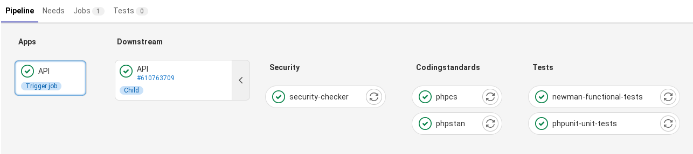

**Decoupling front-end React JS and Symfony back-end API.**

[](https://www.codacy.com/gl/phil-all/shopping-list/dashboard?utm_source=gitlab.com&utm_medium=referral&utm_content=phil-all/shopping-list&utm_campaign=Badge_Grade)

* * *

## 1. <a name='Tableofcontent'></a>Table of content

1.  [:tada: Getting started](#tada:Gettingstarted)
    -   1.1. [Prerequisites](#Prerequisites)
    -   1.2. [Global Arhitecture](#GlobalArhitecture)
    -   1.3. [Installation](#Installation)

2.  [:wrench: Configuration](#wrench:Configuration)
    -   2.1. [Environments](#Environments)

3.  [:construction_worker: Gitlab-CI](#construction_worker:Gitlab-CI)

4.  [:white_check_mark: Tests](#white_check_mark:Tests)
    -   4.1. [API tests](#APItests)
    -   4.2. [Front tests](#Fronttests)

5.  [:hammer: Makefile commands](#Makefilecommands)
    -   5.1. [Project makefile](#ProjectMAkefile)
    -   5.2. [API makefile](#APImakefile)

6.  [:sparkles: Features](#sparkles:Features)

* * *

## 2. <a name='tada:Gettingstarted'></a>1. :tada: Getting started

### 2.1. <a name='Prerequisites'></a>1.1. Prerequisites

To be installed, and used, this project requires:

-   git
-   composer
-   npm
-   yarn
-   docker-compose

### 2.2. <a name='GlobalArhitecture'></a>1.2. Global Arhitecture


### 2.3. <a name='Installation'></a>1.3. Installation

First, clone project repository.

```bash
git clone git@gitlab.com:phil-all/boilerplate-symfonyreact.git <your_project_name>
```

#### 2.3.1. <a name='Dockerenvironment'></a>1.3.1. Docker environment

Launch docker root project:

```bash
docker-compose build && docker-compose up -d
```

#### 2.3.2. <a name='SymfonyAPI'></a>1.3.2. Symfony API

##### initialisation

All API bash commands will be made from api directory.

Install composer packages:

```bash
# from ./apps/api
composer install
```

Generate SSL keys for JWT authentication:

```bash
# from ./apps/api
php bin/console lexik:jwt:generate-keypair
```

Create a .env.local file, and move in **JWT_PASSPHRASE** from .env file:

##### API endpoints

| url                    | description               |
| ---------------------- | ------------------------- |
| 127.0.0.1:8700/docs    | API swagger documentation |
| 127.0.0.1:8700/api/... | API endpoints             |

#### 2.3.3. <a name='Reactforntapp'></a>1.3.3. React fornt app

##### Initialisation

All front bash commands will be made from front directory.

yarn is executed when node container is launch.

Front app is accessible from 127.0.0.1:3000

#### 2.3.4. <a name='Database'></a>1.3.4. Database

Database port is 5432.

Pgadmin is accessible from 127.0.0.1:8732

| user | user mail       | password |
| ---- | --------------- | -------- |
| user | user@boiler.com | pass     |

* * *

## 3. <a name='wrench:Configuration'></a>2. :wrench: Configuration

### 3.1. <a name='Environments'></a>2.1. Environments

#### 3.1.1. <a name='APISymfony'></a>2.1.1. API Symfony

**Developpement**
Set your own variables in a .env.local file, it would override .env file if needed.

A makefile is provide

**Test**
As for env.local, copy your JWT_PASSPHRASE in env.test.local

**Datas transaction and rollback in phpunit tests**
To ensure each test to be isolated regarding database actions, and be performed as many times as necessary, without other test side effect, be sure dama/doctrine-test-bundle is well configured.

```yaml
# ./config/packages/test/dama_doctrine_test
dama_doctrine_test:
    enable_static_connection: true
    enable_static_meta_data_cache: true
    enable_static_query_cache: true
```

```xml
<!-- ./phpunit.xml.dist -->

...
    <extensions>
        <extension class="DAMA\DoctrineTestBundle\PHPUnit\PHPUnitExtension" />
    </extensions>
</phpunit>
```

#### 3.1.2. <a name='Demousers'></a>2.1.2. Demo users

| username          | password |
| ----------------- | -------- |
| user1@example.com | pass1234 |
| user2@example.com | pass1234 |

* * *

## 4. <a name='construction_worker:Gitlab-CI'></a>3. :construction_worker: Gitlab-CI

Two pipelines are available:

-   one for API



-   one for Front app

* * *

## 5. <a name='white_check_mark:Tests'></a>4. :white_check_mark: Tests

### 5.1. <a name='APItests'></a>4.1. API tests

**Unit tests**

Unit tests are made with phpunit. Use make file:

```bash
# from ./apps/api/
make unit
```

**Endpoint tests**

Endpoint tests are made with newman/postman. Use make file:

```bash
# from ./apps/api/
make endpoint
```

### 5.2. <a name='Fronttests'></a>4.2. Front tests

```bash
# from ./ apps/front/
yarn run test
```

* * *

## 6. <a name='hammer:Makefilecommands'></a>5. :hammer: Makefile commands

### 6.1. <a name='Projectmakefile'></a>5.1 Project makefile

From root, run make follwed by:

```code
 —— Commands list 🛠️️ ————————————————————————————————————————————————————————— 
help                           Outputs this help screen
 —— Docker 🐳 ———————————————————————————————————————————————————————————————— 
build                          Builds the Docker images
up                             Start the docker hub in detached mode (no logs)
down                           Stop the docker hub
rm                             Remove the docker hub
start                          Build and start the containers
restart                        Restart the docker hub
logs                           Show live logs
bash                           Connect to the PHP FPM container
pgsql                          Connect to database in postgres container
status                         Docker hub status
 —— Git 🔀 ——————————————————————————————————————————————————————————————————— 
reset                          Reset last commit on local
```

### 6.2. <a name='APImakefile'></a>5.2. API makefile

From api directory (./apps/api/), run make followed by:

```code
 —— Commands list 🛠️️ ————————————————————————————————————————————————————————— 
help                           Outputs this help screen
 —— Docker 🐳 ———————————————————————————————————————————————————————————————— 
build                          Builds the Docker images
up                             Start the docker hub in detached mode (no logs)
down                           Stop the docker hub
rm                             Remove the docker hub
start                          Build and start the containers
restart                        Restart the docker hub
logs                           Show live logs
bash                           Connect to the PHP FPM container
pgsql                          Connect to database in postgres container
status                         Docker hub status
 —— Composer 🧙 —————————————————————————————————————————————————————————————— 
update                         Update composer packages (twice to fix a doctrine deprecation)
dump                           dump autoloading
dump-opt                       Optimize autoloading
no-lock                        Remove composer lock
no-vendor                      Remove vendor
install-vendor                 Remove and reinstall vendor
vendor-up                      Remove, reinstall and update vendor
 —— Symfony 🎵 ——————————————————————————————————————————————————————————————— 
sf                             List all Symfony commands or pass the parameter "c=" to run a given command, example: make sf c=about
cc                             Clear the cache
user                           Make user
entity                         Make entity
migration                      Make migrations
router                         Display routing
 —— Grumphp 😡 ——————————————————————————————————————————————————————————————— 
grum                           Run grumphp tests
 —— Database 🛢️ —————————————————————————————————————————————————————————————— 
drop                           Drop database
create                         Create database
migrate                        Migrations migrate
drop-test                      Drop test database
create-test                    Create test database
migrate-test                   Migrations migrate for test
 —— Fixtures 🤡 —————————————————————————————————————————————————————————————— 
load                           Load fixtures
set-db                         Reset database and seed with fixtures
load-test                      Load test fixtures
set-db-test                    Reset test database and seed with fixtures
 —— Git 🔀 ——————————————————————————————————————————————————————————————————— 
reset                          Reset last commit
 —— Tests ✅ ————————————————————————————————————————————————————————————————— 
phpunit                        Run all phpunit tests
unit                           Run unit tests only
endpoint                       Run end points tests only
```

* * *

## 7. <a name='sparkles:Features'></a>6. :sparkles: Features

| user feature   | is done            |
| -------------- | ------------------ |
| registration   |                    |
| authentication | :heavy_check_mark: |
| management     |                    |

| shopping-list feature | is done            |
| --------------------- | ------------------ |
| login                 | :heavy_check_mark: |
| products              | :heavy_check_mark: |
| departments           | :heavy_check_mark: |
| shopping list         |                    |
| search                |                    |
