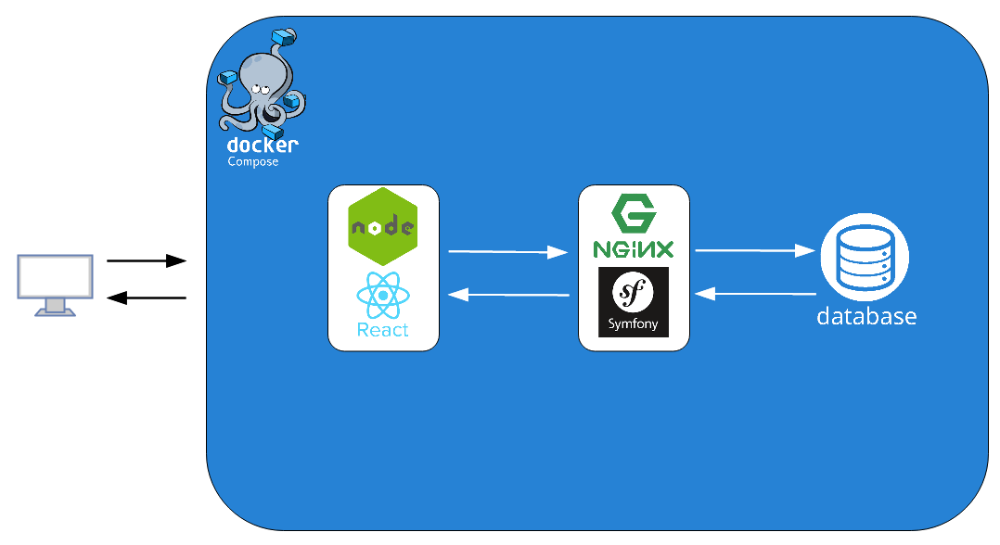

# Boiler plate: Symfony / React

**Decoupling front-end React JS with Symfony back-end API boiler plate.**


* * *

[](https://www.codacy.com/gl/phil-all/shopping-list/dashboard?utm_source=gitlab.com&utm_medium=referral&utm_content=phil-all/shopping-list&utm_campaign=Badge_Grade)

* * *

## :tada: Getting started

### Prerequisites

To be installed, and used, this project requires:

-   git
-   composer
-   npm
-   yarn
-   docker-compose

### Installation

First, clone project repository.

```bash
git clone git@gitlab.com:phil-all/boilerplate-symfonyreact.git <your_project_name>
```

#### Symfony API

##### initialisation

All API bash command will be made from apps/back directory.

Install composer packages:

```bash
composer install
```

Generate SSL keys for JWT authentication:

```bash
php bin/console lexik:jwt:generate-keypair
```

Create a .env.local file, and move in **JWT_PASSPHRASE** from .env file:

##### about

| url                    | description               |
| ---------------------- | ------------------------- |
| 127.0.0.1:8700/docs    | API swagger documentation |
| 127.0.0.1:8700/api/... | API endpoints             |

#### React fornt app

From apps/front directory:

```bash
npm install
yarn install
```

Fornt app is accessible from 127.0.0.1:3000

#### Database

Database port is 5432.

Pgadmin is accessible from 127.0.0.1:8732

| user | user mail       | password |
| ---- | --------------- | -------- |
| user | user@boiler.com | pass     |

### Global Arhitecture



### Folder stucture

```bash
└── boilerPlate-SymfonyReact/
    │
    ├── apps/
    │   ├── back/      # Symfony API
    │   ├── database/  # Postgres & Pgadmin
    │   ├── front/     # React front app
    │   └── nginx/     # Nginx
    │
    ├── documentation/ # your project documentation
    │   ├── readme-assets/  # your readme assets
    │   └── specifications/ # your project specifications
    │
    └── docker-compose.yaml
```
